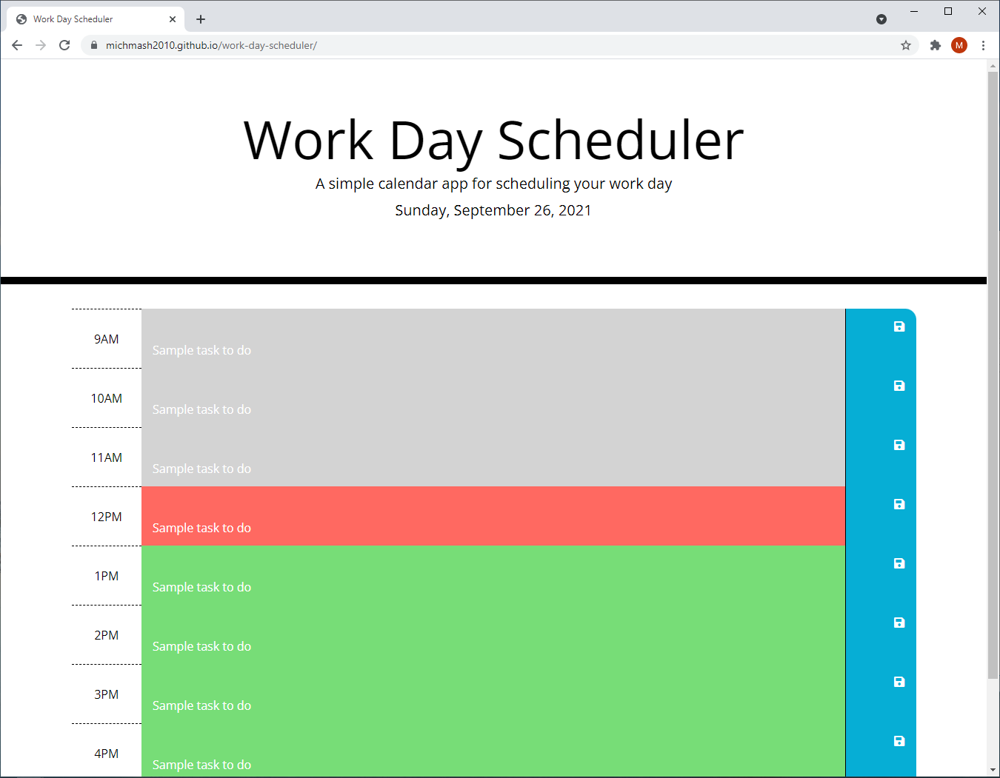

# Challenge 5: Work Day Scheduler
for UCF Coding Bootcamp

## Link to the Live Page
https://michmash2010.github.io/work-day-scheduler/

## Description
This page currently in development features JQuery, Bootstrap, and the legacy Moment.js in addition to HTML, CSS, and JavaScript.

## Work Day Scheduler Webpage Screenshot

## Credits
Starter Code and a mock-up for the basic design/appearance of the Work Day Scheduler Webpage are included in the assignment.